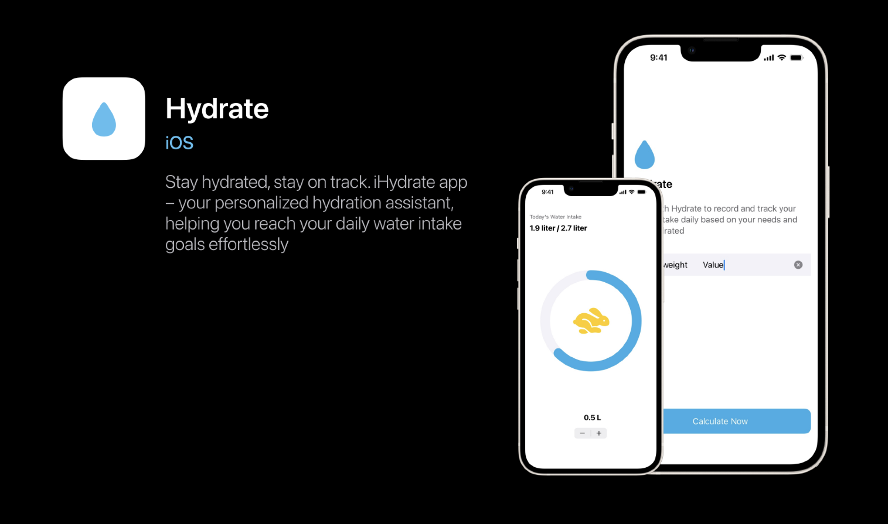

# 💧 iHydrate - Stay Hydrated, Stay Healthy

Welcome to **iHydrate**, a water intake tracking app designed to help you stay hydrated.

  

## 📖 Project Purpose

**iHydrate** is a simple yet powerful app that helps users monitor and achieve their daily water intake goals. It’s designed to encourage consistent hydration and promote better health.

## 🌟 Features

- **Personalized Water Goals**: Set a daily hydration goal based on your body weight.
- **Custom Notifications**: Choose the frequency and hours to receive reminders. (Coming soon!)
- **Progress Tracking**: Visualize your water intake progress in real-time.
- **Fun Animations**: See progress milestones with cute animal icons.

## 📱 Screens

1. **Onboarding**: Set your body weight and customize your hydration plan.
2. **Notification Preferences**: Specify start and end times for reminders and intervals.
3. **Water Intake Tracking**: Visual progress display with indicators for various stages:
   - 💤 Start your hydration journey.
   - 🐢 Getting there.
   - 🐇 Approaching the goal.
   - 👏 Goal achieved!

## 🖼️ Screenshots

  
  
  
  
  

## 🛠️ Installation

To run **iHydrate** locally, follow these steps:

### Steps

1. **Download the Code**
   - Go to the [iHydrate GitHub repository](https://github.com/Hayaalbaker/iHydrate).
   - Click the green **Code** button, then select **Download ZIP**.
   - Unzip the downloaded file on your computer.

2. **Open in Xcode**
   - Open the unzipped folder and locate the `iHydrate.xcodeproj` file.
   - Double-click `iHydrate.xcodeproj` to open the project in Xcode.

3. **Build and Run**
   - In Xcode, select a simulator or connect an iOS device.
   - Press `Cmd + R` to build and run the app.

Now you’re ready to test **iHydrate** locally on your device or simulator!

## 📬 Contact

If you need any additional information or help, feel free to connect on GitHub at [Hayaalbaker](https://github.com/Hayaalbaker) or email me at haya.aalbaker@gmail.com.
